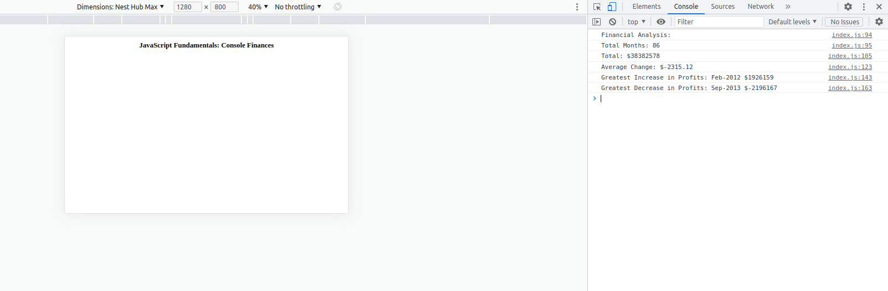

# Console-Finances-EDementieva
## Description

The task in this Challenge is to create code for analyzing the financial records of a company using the concepts we've learned.
The financial dataset was provided.

Our task is to calculate each of the following:

    The total number of months included in the dataset.

    The net total amount of Profit/Losses over the entire period.

    The average of the changes in Profit/Losses over the entire period.

    The greatest increase in profits (date and amount) over the entire period.

    The greatest decrease in profits (date and amount) over the entire period.

## Installation

N/A

## Usage

To review the code, open the Chrome DevTools by pressing Command+Option+I (macOS) or Control+Shift+I (Windows). A console panel should open either below or to the side of the webpage in the browser. 

https://coralpeony.github.io/Console-Finances-EDementieva/

## Credits

N/A

## License

N/A